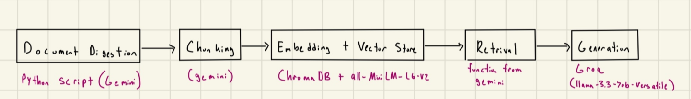

# Project 1 Planning: The Unofficial Guide

> Write this document before you write any pipeline code.
> Your spec and architecture diagram are what you'll use to direct AI tools (Claude, Copilot, etc.) to generate your implementation — the more specific they are, the more useful the generated code will be.
> Update the Retrieval Approach and Chunking Strategy sections if you change your approach during implementation.
> Update this file before starting any stretch features.

---

## Domain

My domain is going to be things to do around UC San Diego. This knowlegde is valuable because new students will want to know where to go and explore. They want to be able to experience San Diego. There is too much information, so having it in one place will be helpful for students. This can also help students that are still deciding if they would like to go to UC San Diego. They can ask about activities and resturants around UC San Diego.

---

## Documents

<!-- List your specific sources: URLs, subreddit names, forum threads, or file descriptions.
     Aim for at least 10 sources that together cover different subtopics or perspectives within your domain. -->

| # | Source | Description | URL or location |
|---|--------|-------------|-----------------|
| 1 | Ultimate Guide to UC San Diego | Gives areas to go to around UC San Diego | https://prked.com/post/your-ultimate-guide-to-an-unforgettable-time-around-uc-san-diego |
| 2 | 26 things to do in San Diego | List of things to do around SD | https://californiathroughmylens.com/things-to-do-in-san-diego/ |
| 3 | Top 10 Eats Near UCSD | 10 food places near UC San Diego | https://ucsdguardian.org/2024/01/29/top-10-eats-near-ucsd/ |
| 4 | Reddit San Diego | Favorite beach in San Diego | https://www.reddit.com/r/sandiego/comments/osxcqd/whats_your_favorite_beach_in_san_diego/ |
| 5 | Study spots | 10 best stpots to study on campus | https://today.ucsd.edu/story/10-best-spots-to-study-on-campus |
| 6 | Reddit Food San Diego | Best boba places in San Diego | https://www.reddit.com/r/FoodSanDiego/comments/1ior4sy/best_boba_places_in_san_diego/ |
| 7 | Sunset spots | 5 Best spots to watch the sunset in San Diego | https://soulsummittravel.com/2024/04/30/sunset-spots-san-diego/|
| 8 | Running trails in SD| Best places to run in San Diego| https://www.chelseyexplores.com/best-places-to-run-in-san-diego/ |
| 9 | Food places at UC San Diego| Places to Eat at UCSD | https://blink.ucsd.edu/facilities/services/general/personal/dining.html |
| 10 | Activities at UC San Diego | 15 Ideas for your UC San Diego Bucket List| https://today.ucsd.edu/story/15-ideas-for-your-uc-san-diego-bucket-list |

---

## Chunking Strategy: Recursive chunking

<!-- How will you split documents into chunks?
     State your chunk size (in tokens or characters), overlap size, and explain why those
     numbers fit the structure of your documents.
     A review-heavy corpus warrants different chunking than a long FAQ. -->

**Chunk size: 1000 characters**

**Overlap: 150 characters**

**Reasoning:**
I will be using recursive chunking because the structure of the urls are full documents and there are many paragraphs for each page. It would not be effective to use fixed size chunking here. I chose 1000 characters because after testing this is a nice number that captures most of the text. As for the overlap, I chose 150 characters because this will capture parts of the beginning of portions that may have been cut off and give further context within the chunk.

---

## Retrieval Approach

<!-- Which embedding model are you using (e.g., all-MiniLM-L6-v2 via sentence-transformers)?
     How many chunks will you retrieve per query (top-k)?
     If you were deploying this for real users and cost wasn't a constraint, what tradeoffs
     would you weigh in choosing a different embedding model — context length, multilingual
     support, accuracy on domain-specific text, latency? -->

**Embedding model:**
I will be using the all-MiniLM-L6-v2 via sentence-transformers model.

**Top-k:**
I will retrieve the top 4 chunks per query because there are many documents and some have overlapping topics in each source.

**Production tradeoff reflection:**
If cost wasn't a constraint for this project, I would opt to use gemini embedding 2 because it has a higher context window than all-MiniLM-L6-v2. This allows for better chunking of the data which leads to better retrieval. I would trade the latency of all-MiniLM-L6-v2 for a bit slower gemini embedding 2 because the accuracy of the model is higher.

---

## Evaluation Plan

<!-- List your 5 test questions with their expected correct answers.
     Questions should be specific enough that you can judge whether the system's response
     is right or wrong. "What are good dining halls?" is too vague.
     "What do students say about wait times at [dining hall name] during lunch?" is testable. -->

| # | Question | Expected answer |
|---|----------|-----------------|
| 1 | Which floor of Geisel Library is the silent study floor? | The 8th floor of Geisel is considered the silent study floor |
| 2 | What is a good dirt trail to run? | Tecolote |
| 3 | Are there any museums or aquariums I can visit near campus? | Birch Aquarium or Museum of Contemporary Art |
| 4 | What is a good place to nap on campus? | Hammock Swings|
| 5 | Which beaches near campus have fire pits? | La Jolla Shores or Mission Beach |

---

## Anticipated Challenges

<!-- What could go wrong? Name at least two specific risks with reasoning.
     Consider: noisy or inconsistent documents, missing source attribution, off-topic
     retrieval, chunks that split key information across boundaries. -->

1. The chunk might cut off crutial information that relates to the question. This will cause the RAG to return partial information cut off from what we actually want

2. Another challenge could be that there is too much noise. It might hallucinate on a query when asked a question because there is filler in the paragraphs.

---

## Architecture

<!-- Draw a diagram of your pipeline showing the five stages:
     Document Ingestion → Chunking → Embedding + Vector Store → Retrieval → Generation
     Label each stage with the tool or library you're using.
     You can use ASCII art, a Mermaid diagram, or embed a sketch as an image.
     You'll use this diagram as context when prompting AI tools to implement each stage. -->

---

## AI Tool Plan

<!-- For each part of the pipeline below, describe:
     - Which AI tool you plan to use (Claude, Copilot, ChatGPT, etc.)
     - What you'll give it as input (which sections of this planning.md, which requirements)
     - What you expect it to produce
     - How you'll verify the output matches your spec

     "I'll use AI to help me code" is not a plan.
     "I'll give Claude my Chunking Strategy section and ask it to implement chunk_text()
     with my specified chunk size and overlap" is a plan. -->

**Milestone 3 — Ingestion and chunking:**

I plan to use Gemini to help me parse through each of the document to generate clean text that I can use for my embedding model. I will also use Gemini to help me implement the chunk_text() function with instructions of what my chunking size and overlap are.

**Milestone 4 — Embedding and retrieval:**

I will use Gemini to also help me generate the retrieval of the top-5 closest chunks to the specific query. 

**Milestone 5 — Generation and interface:**

I will use Gemini and Claude code to make my interface for this RAG. I will also use Groq for the generation with llama-3.3-70b-versatile
